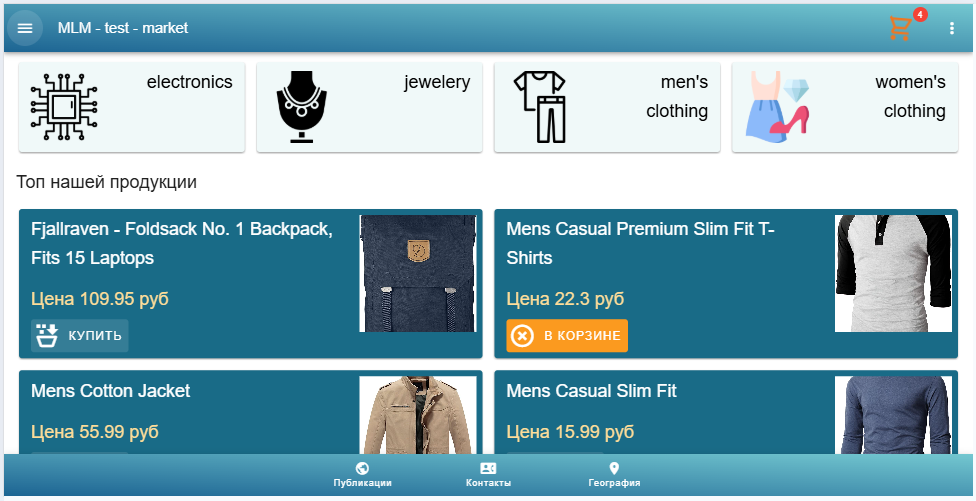

# Nuxt Minimal Market

Look at the [Nuxt documentation](https://nuxt.com/docs/getting-started/introduction) to learn more.

## 💿 Install

npm i

## ⚡  Starting the Development Server

npm run dev

 🛠️ **Settings**

. . . . . . . . 

## 💡 Usage

see host links tap any

## ✨ Задача
Написать приложение(Vue.js ^3 можно использовать Nuxt, TS only), которое содержит три страницы:
- страница со списком категорий и продуктов
- страница продукта
- страница корзины

### Данные
Проще всего использовать демо-магазин: 
- https://fakestoreapi.com

### Страница «Список продуктов и категорий»
Страница содержит список товаров и категорий в любом удобном виде: сетка, список, таблица.
Данные для отображения категории:
- название категории
- изображение категории
Данные для отображения товара:
- название товара
- цена товара
- изображение товара
- кнопка «Купить»

#### Переход на детали категории
При нажатии на категорию приложение переходит на страницу с подкатегориями и товарами, принадлежащими этой категории.

#### Переход на детали товара
При нажатии на товар приложение переходит на страницу «Детали товара».

### Страница «Детали товара»
Страница содержит детали о товаре:
- названием товара
- описание товара
- изображение товара
- цена товара
- кнопка «Купить»

### Кнопка «Купить»
Кнопка добавляет товар в «корзину»
Корзина - любое локальное хранилище со списком добавленных товаров.

### Иконка «Корзина»
На всех страницах отображается иконка корзины с количеством товаров, добавленных в нее. При нажатии на иконку приложение переходит на страницу «Корзина»

### Страница «Корзина»
Страница содержит список добавленных товаров и кнопку «Оформить заказ».
Любой товар в списке можно удалить по нажатию на кнопку «Удалить».

### Переход по страницам
Состояние страницы отображается в url'е. При переходе по url отображается та страница, которая принадлежит этой url'е.

### Кнопка «Оформить заказ»
При нажатии на кнопку показывается текст с поздравлением о покупке.

## Фреймворк
- VueJS ^3 (TS)

## Стили
- SCSS modules

## Дизайн
Использовать Vuetify

## 📑 License
[MIT](http://opensource.org/licenses/MIT)

